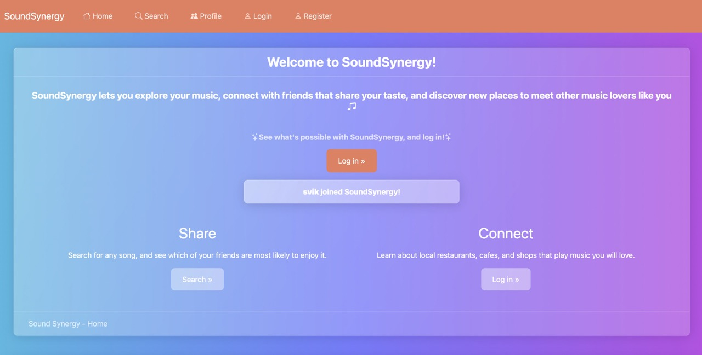
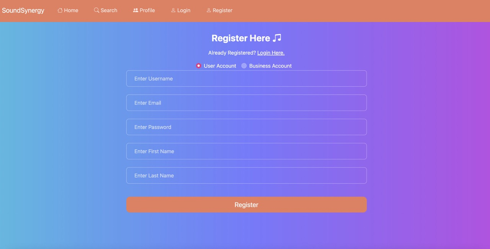
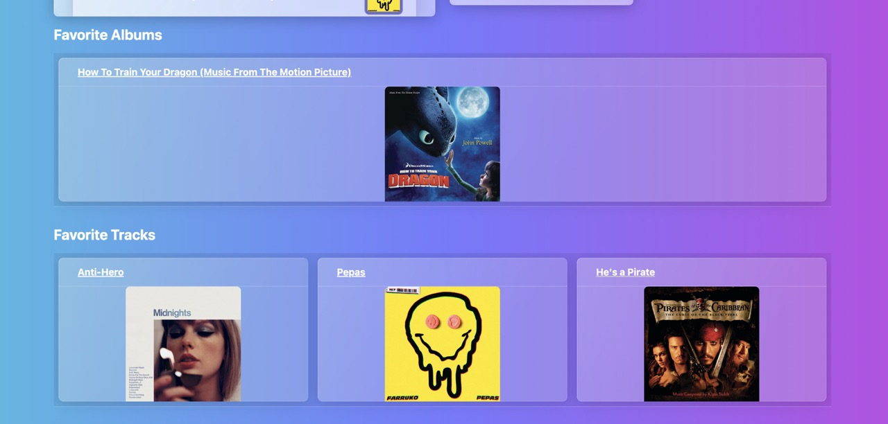
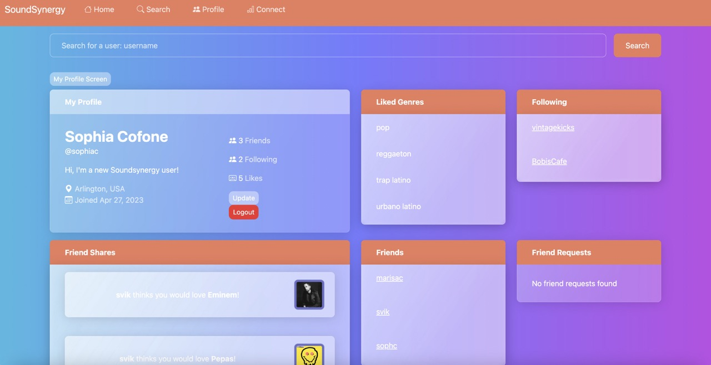
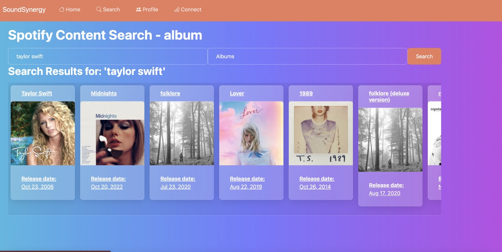
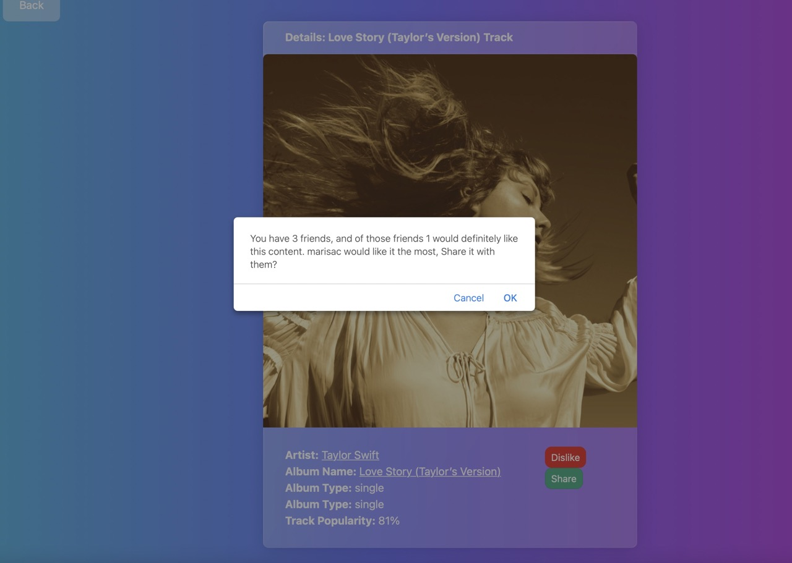
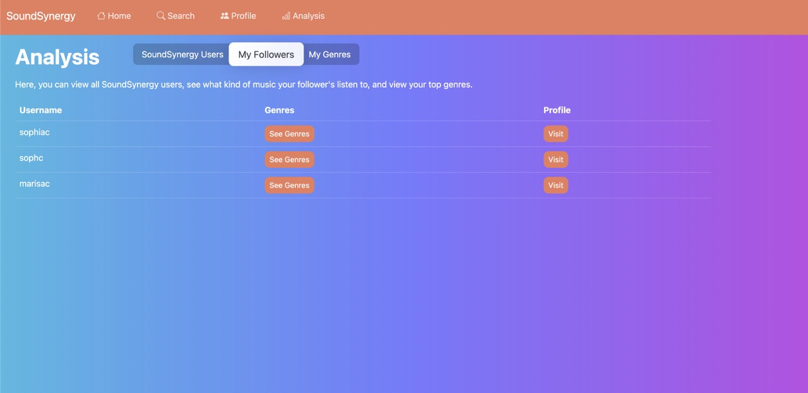
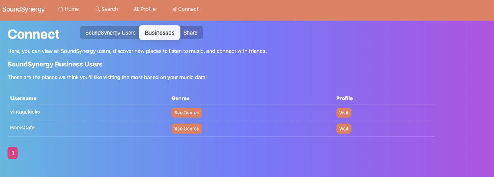
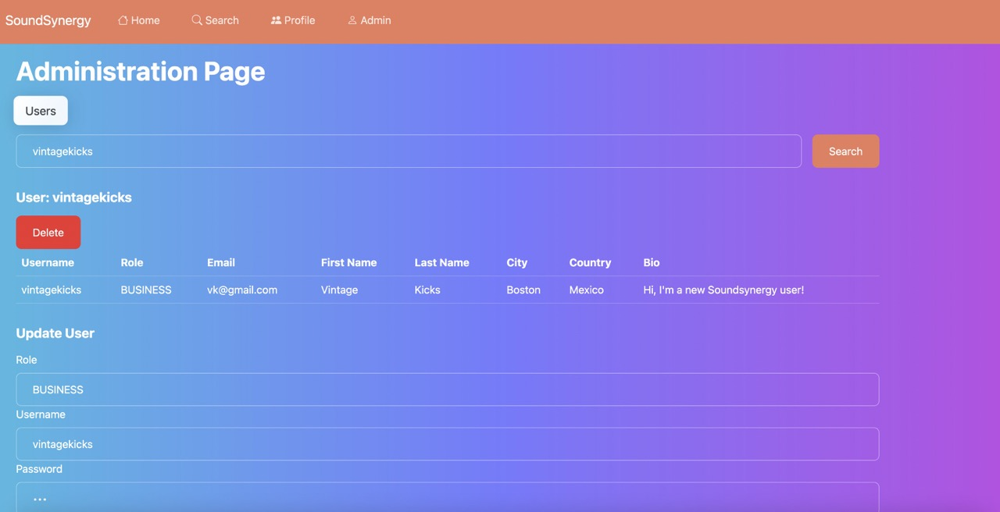

# SoundSynergy: A React app designed to connect music lovers
SoundSynergy is a feature-rich web application that allows users to build a music profile, connect with friends that share the same music tastes, and discover new businesses that play music that a specific user will enjoy.

This app includes user authentication, catering to regular users, anonymous users, business users, and admin users. Each user type supports unique veiws and features. The application also supports concurrent logins, account creation, profiles, and profile editing. The primary focus is on creating user profiles, searching for songs, artists, and albums, and facilitating interactions among users and businesses.

## Key Features
* User Profiles: Users can create personalized profiles, track their liked songs, artists, and albums, and share content with friends. 
* 
* Social Features: Users can connect with friends through a friend request system, follow other users, and establish a follower/following relationship. 
* 
* Content Recommendations: The application suggests friends who are likely to enjoy specific content based on their past likes, resolving the issue of not knowing which friends would appreciate certain songs. 
*  
* Business Integration: Businesses can create accounts, view the content liked by their followers, and tailor their music offerings to attract more customers.
* 
* Local Business Recommendations: Users can explore recommendations for local businesses with similar music preferences, fostering connections with like-minded individuals.
* 
* Administration: Admin users can edit user information, change roles, edit profiles, and delete users.
* 

## Tech Stack:
* Front-end: React.js, Bootstrap, custom CSS
* Back-end: Node.js server
* Database: MongoDB
* Additional Technologies: Redux for state management, JavaScript, server sessions for user sessions
* Music Content: Integration with Spotify's public API
